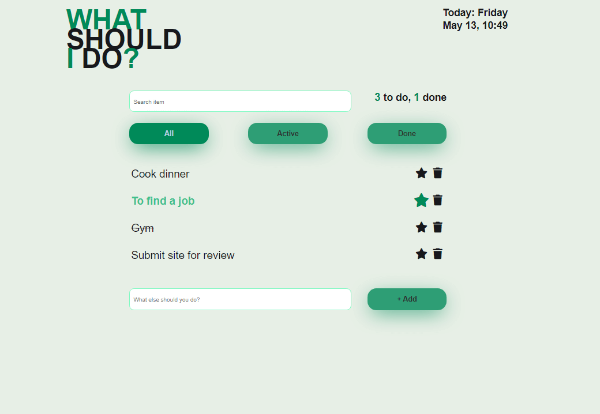
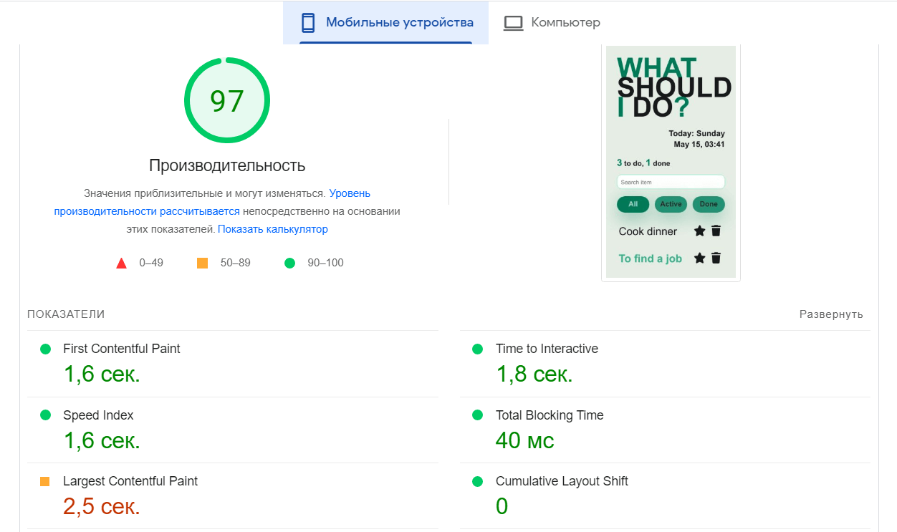
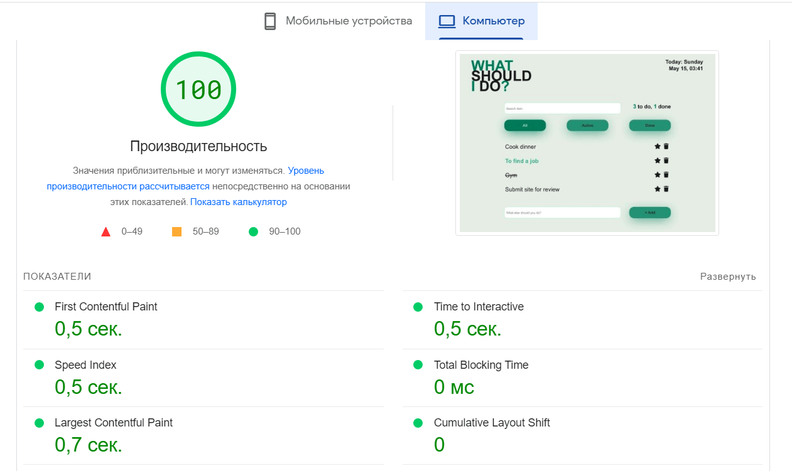

# WSID 

>What should I do? -  SPA для составления необходимого списка нужных задач. 

https://what-should-i-do-fawn.vercel.app/

## Описание

При открытии приложения отображается список задач составленный нами. Список можно фильтровать на активные задачи (active), уже сделанный (done) и все (all). Вверху мы можем искать задачи из списка по введенной в поиске строке. Внизу есть функция добавления новых задач (+ add). Так же на странице находится счетчик выполненных и оставшихся задач.

Задачи можно помечать как важные, выполненные (срабатывает при нажатии на задачу) и удалять задачу из списка совсем.

## Команды

<table>
  <thead>
    <tr>
      <th>Команда</th>
      <th>Результат</th>
    </tr>
  </thead>
  <tbody>
    <tr>
      <td width="30%"><code>npm install</code></td>
      <td>Установить зависимости</td>
    </tr>
    <tr>
      <td><code>npm start</code></td>
      <td>Запустить приложение в режиме разработки.</td>
    </tr>
     <tr>
      <td><code>npm test</code></td>
      <td>Запуск тестов</td>
    </tr>
    <tr>
      <td><code>npm run build</code></td>
      <td>Собрать проект для продакшена</td>
    </tr>
  </tbody>
</table>

## Используемые технологии

React, , React Hooks

